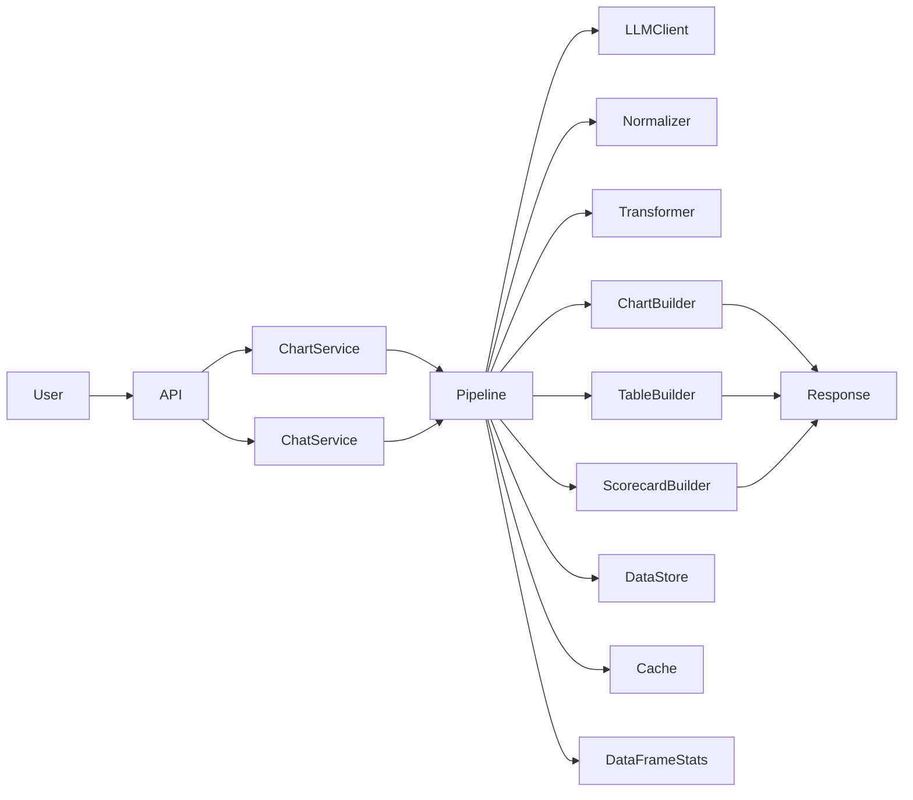
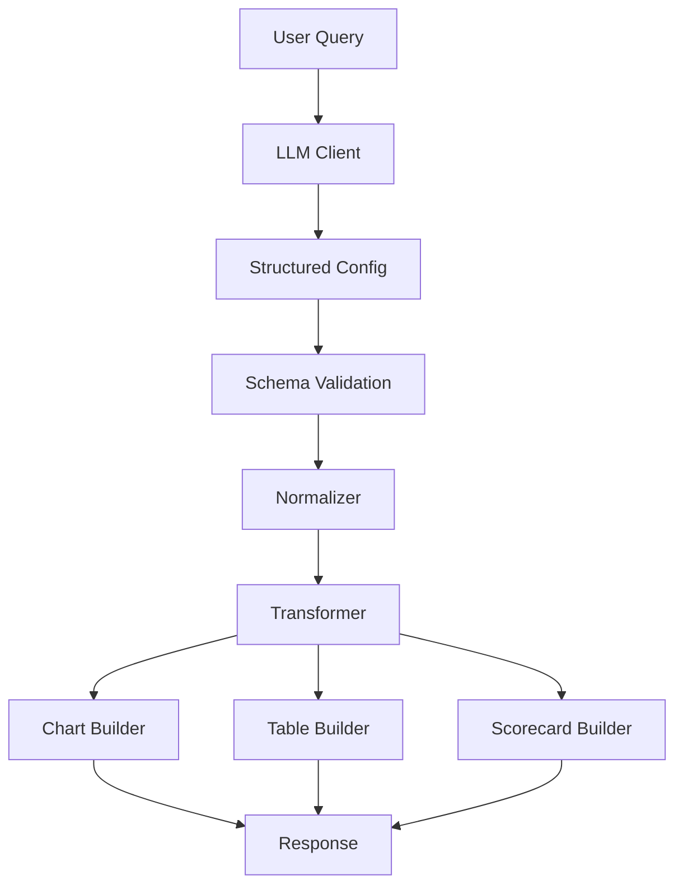

# AI-Powered Data Analytics Engine

## Overview

An AI-driven analytics backend built with FastAPI, Pandas, and OpenAI that converts natural-language requests into charts, KPI scorecards, tables, and analytical insights.

The platform enables users to explore datasets without writing SQL, Pandas code, or visualization logic manually.

### Key Features

- Natural language analytics
- AI-powered chart generation
- KPI scorecards
- Dynamic table generation
- Dataset profiling and metadata extraction
- Automatic date and metric detection
- Result caching
- Async task management
- Schema validation
- Safe execution pipeline

---

# System Architecture

The application follows a layered architecture:

1. **API Layer** handles incoming requests.
2. **Service Layer** orchestrates business workflows.
3. **Pipeline Layer** transforms user intent into structured analytics.
4. **Utility Layer** manages caching, metadata, statistics, and tasks.
5. **LLM Layer** generates chart and analytical configurations.
6. **Builders** create final chart, table, and KPI outputs.

## High-Level Architecture



---


# Project Structure

```text
Folder/
│
├── Main.py                     # Application entry point
│
└── App/
    │
    ├── Api/
    │   └── routes.py           # FastAPI route definitions
    │
    ├── Pipeline/
    │   ├── chart_builder.py    # Chart generation logic
    │   ├── normalizer.py       # LLM output normalization
    │   ├── transformer.py      # Data transformation layer
    │   ├── table_builder.py    # Table generation logic
    │   ├── llm_client.py       # OpenAI integration
    │   └── scorecard.py        # KPI scorecard generation
    │
    ├── Services/
    │   ├── chart_service.py    # Chart workflow orchestration
    │   └── chat_service.py     # Conversational analytics service
    │
    ├── Schemas/
    │   └── chart_schema.py     # Request/response schemas
    │
    └── Utils/
        ├── task_manager.py     # Async task management
        ├── df_stats.py         # DataFrame statistics
        ├── column_utils.py     # Column classification utilities
        ├── data_store.py       # Dataset metadata store
        └── cache.py            # Result caching layer
```

---

# Component Responsibilities

## API Layer

### `routes.py`

Responsible for:

- Exposing REST endpoints
- Request validation
- Delegating requests to services

---

## Service Layer

### `chart_service.py`

Handles:

- Chart generation requests
- Pipeline orchestration
- Response formatting

### `chat_service.py`

Handles:

- Natural language analytics requests
- LLM interaction
- Query execution
- Result interpretation

---

## Pipeline Layer

### `llm_client.py`

Responsible for:

- Communicating with OpenAI
- Generating chart specifications
- Producing KPI and aggregation suggestions

### `normalizer.py`

Responsible for:

- Standardizing LLM outputs
- Schema alignment
- Field validation

### `transformer.py`

Responsible for:

- Data reshaping
- Aggregation preparation
- Feature transformations

### `chart_builder.py`

Responsible for:

- Constructing visualization payloads

### `table_builder.py`

Responsible for:

- Summary tables
- Pivot tables

### `scorecard.py`

Responsible for:

- KPI generation
- Metric aggregation
- Human-readable formatting

---

## Utility Layer

### `task_manager.py`

Provides:

- Background task tracking
- Task status monitoring
- Task cleanup

### `df_stats.py`

Provides:

- DataFrame profiling
- Statistical summaries

### `column_utils.py`

Provides:

- Numeric column detection
- Identifier detection
- Metric classification

### `data_store.py`

Provides:

- Dataset metadata storage
- Profile caching
- Dataset fingerprints

### `cache.py`

Provides:

- Query caching
- LRU caching
- Reusable computation results

---

# Technology Stack

| Category | Technology |
|-----------|------------|
| Language | Python |
| API Framework | FastAPI |
| Validation | Pydantic |
| Data Processing | Pandas |
| Numerical Computing | NumPy |
| AI Integration | OpenAI |
| Visualization | Plotly |
| Charts | Matplotlib |
| Database Driver | PyMongo |
| Environment Management | python-dotenv |
| Async HTTP | HTTPX |
| Spreadsheet Processing | OpenPyXL |
| Server | Uvicorn |

---

# Installation

## Prerequisites

- Python 3.10+
- OpenAI API Key
- MongoDB (if enabled)

## Clone Repository

```bash
git clone <repository-url>
cd Folder
```

## Install Dependencies

```bash
pip install -r requirements.txt
```

## Configure Environment

Create a `.env` file:

```env
OPENAI_API_KEY=your_api_key

MONGODB_URI=mongodb://localhost:27017

DATABASE_NAME=analytics_db
```

---

# Running the Application

## Development

```bash
uvicorn Main:app --reload
```

## Production

```bash
uvicorn Main:app --host 0.0.0.0 --port 8000
```

---

# Core Workflow



---

# Caching Strategy

The system optimizes repeated analytics requests using:

1. Dataset fingerprinting
2. Query hashing
3. In-memory cache
4. Metadata reuse

```text
Dataset
   ↓
Fingerprint
   ↓
Cache Key
   ↓
Cached Result
```

---

# Supported Analytics Outputs

## Charts

- Bar Chart
- Line Chart
- Area Chart
- Scatter Plot
- Histogram
- Pie Chart
- Box Plot
- Heatmap
- Bubble Chart
- Funnel Chart
- Treemap
- Waterfall Chart
- Stacked Bar Chart
- Grouped Bar Chart

## Tables

- Summary Tables
- Pivot Tables

## KPI Scorecards

Supported aggregations:

- Sum
- Count
- Mean
- Min
- Max

Example:

```json
{
  "label": "Total Revenue",
  "value": "1.25M"
}
```

---

# Environment Variables

| Variable | Description | Required |
|-----------|-------------|----------|
| OPENAI_API_KEY | OpenAI API key | Yes |
| MONGODB_URI | MongoDB connection string | Optional |
| DATABASE_NAME | MongoDB database name | Optional |

---

# Future Enhancements

- Multi-dataset analysis
- Dashboard generation
- Scheduled reporting
- User authentication
- Persistent analytics history
- Advanced visualization recommendations

---
